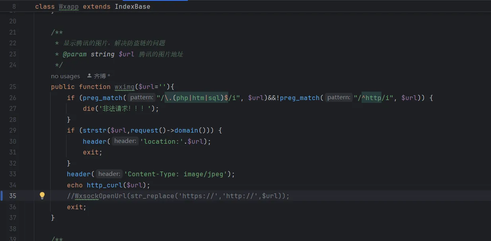
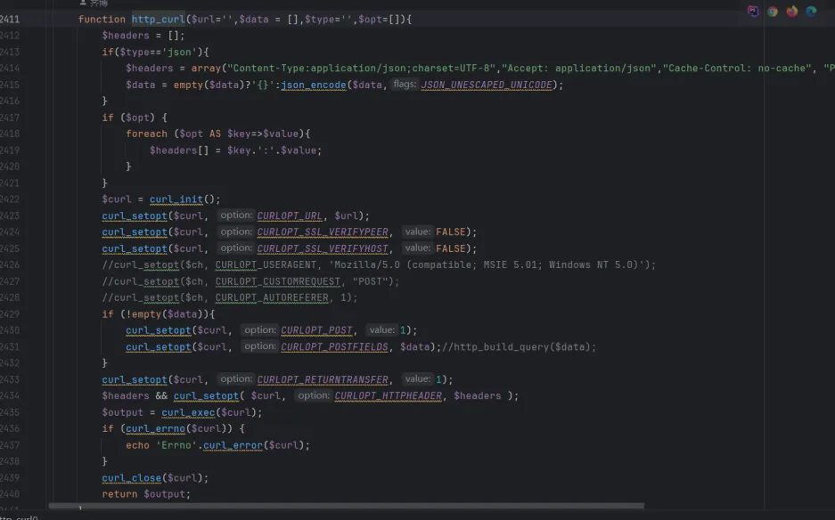
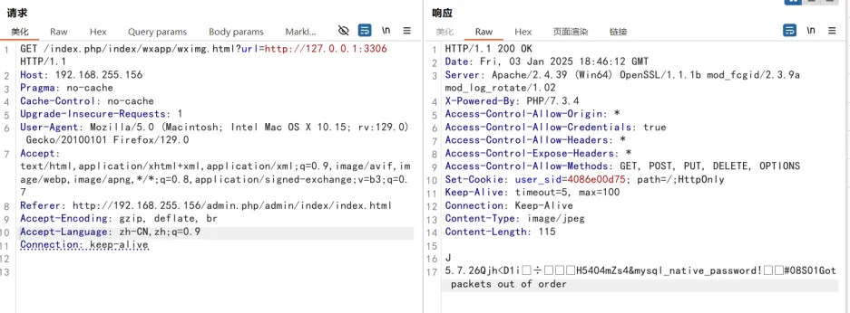

## code analysis

\application\index\controller\Wxapp.php

Use http_curl() in the wximg() function to retrieve the link response content and output it using echo

Http_curl() directly uses curl method to obtain the response content of the request link

Due to the lack of filtering and validation of incoming parameters, it ultimately led to server request forgery

## Vulnerability verification

Modifying the value of the parameter URL can detect host port information. for example http://127.0.0.1:3306 , returned the MySQL service version information for port 3306

